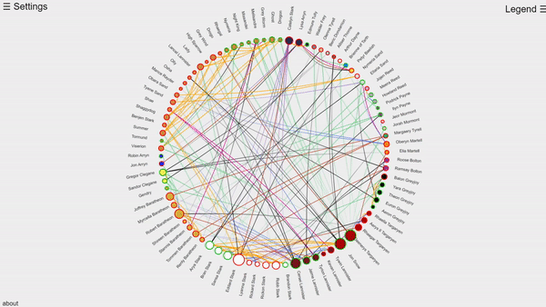
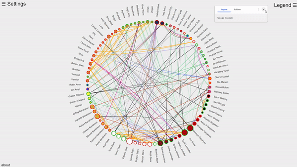

# GOTProject
Node-Link visualization of GOT's dataset

### ACCESS LINK
https://rawcdn.githack.com/baldidon/GOTProject/c1cf95130dfbc3d83582a594123330a8e2979424/main.html

## Introduction

The aim of our project was build a **visualization for a given graph**. The graph concerning the "Game Of Thrones" TV show. It consists of **84 nodes**, each one representing a character of the serie, and *216 
edges*, representing the relations among the characters as of the end of Season 7. Each node contains the following information: name of the character, status (Alive or Deceased), house birth, house marriage and group,
which stays for affiliation of a character to a group which is not a house. The relations are modeled throug *directed and undirected edges*, and can be: death, father, mother, siblings, lover, spouse or allegiance.

## Visualization

We decided to visualize our data in a **circular shape**

with nodes *grouped in keeping with the House Birth of the characters*. Each node is coloured according to its House Birth and is wrapped in a dotted line which represents
the status of the character: **red for dead ones**, **green for the alive ones**.

  

The different relations are visualized with different colours; **directed edges are shown as shaded lines from the source node to the target node**, whereas, obviously, undirected ones don't present this feature.

We also provided a checkbox the user can interact with in order to choose what relations to show, 
and a legend box that helps to understad which colour stays for each House Birth.

  

**One can visualize the relations for a specific node by positioning the mouse over it**; the drawing will only show the nodes involved with the chosen one; the other ones will be opacized to make the visualization
clearer.

  

 
The last feature we supplied is the visualization of card of a character once the user clicks on the node representing it. The visualization is modeled through a force directed graph; with the chosen node at the center. We define different lengths for links given by the type of relation; for example: two nodes that are connected by a "siblings" relation are nearer than two nodes that are related by an "killed" relation.
It's possible to open multiple cards above the main draw, thus is possible to compare the adjacencies of some nodes simultaneously!!

  

